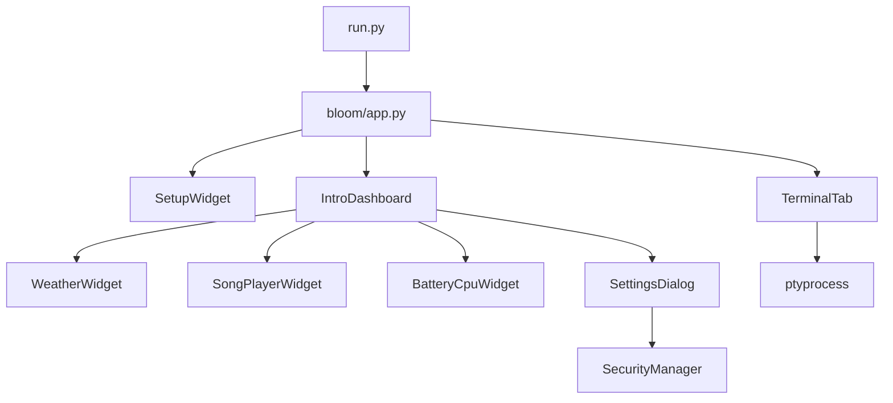
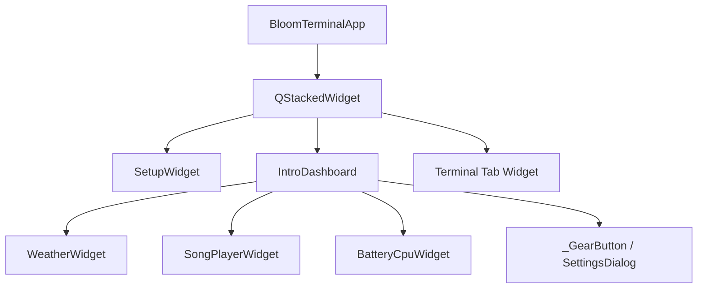
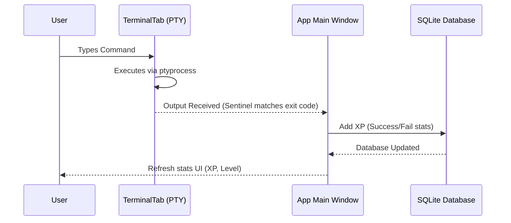

<p align="center">
  
</p>

<p align="center">
  <a href="https://github.com/Aaryanbanskota/Bloom-terminal/releases">
    
  </a>
  <a href="https://github.com/Aaryanbanskota/Bloom-terminal/blob/main/LICENSE">
    
  </a>
  <a href="https://www.python.org/downloads/">
    
  </a>
  <a href="https://github.com/Aaryanbanskota/Bloom-terminal/stargazers">
    
  </a>
  
</p>

<h1 align="center">🌸 Bloom Terminal</h1>

<p align="center">
  <b>A beautifully crafted, gamified, sandboxed desktop terminal emulator — built with PyQt5.</b><br/>
  <i>Where productivity meets RPG-style progression and premium aesthetics.</i>
</p>

<p align="center">
  <a href="#-quick-start">
    
  </a>
  &nbsp;
  <a href="#-built-in-commands">
    
  </a>
  &nbsp;
  <a href="#-gamification--xp-system">
    
  </a>
</p>

---

## ✨ What is Bloom Terminal?

Bloom Terminal is a **premium Python desktop GUI terminal** that looks and feels like a real interactive shell — powered by `ptyprocess` for a true PTY backend — but layered with:

- 🎮 **RPG-style gamification** — earn XP, level up, unlock visual perks
- 🔒 **Directory sandbox** — jail the shell inside a user-chosen folder
- 📊 **Live dashboard** — real-time weather, battery, CPU, music player & more
- 👤 **Avatar & profile editor** — circular crop, preset avatars, XP progress
- 🛡️ **AES-256-GCM encryption** — lock your session and encrypt data on disk

---

## 🏗️ Architecture

### App Flow



### Widget Hierarchy



### Data Flow



---

## 🚀 Quick Start

### 🌸 One-Command Installation

Install the latest version of Bloom Terminal with a single command:

```bash
curl -fsSL https://raw.githubusercontent.com/Aaryanbanskota/Bloom-terminal/main/install.sh | bash
```

Or, using wget:

```bash
wget -qO- https://raw.githubusercontent.com/Aaryanbanskota/Bloom-terminal/main/install.sh | bash
```

After installation, launch Bloom from your terminal:

```bash
bloom
```

Or search **Bloom Terminal** from your desktop's application launcher.

### 🔧 Manual Setup (Developers)

If you'd like to clone the repository and run Bloom Terminal manually:

```bash
# 1. Clone the repo
git clone https://github.com/Aaryanbanskota/Bloom-terminal.git
cd Bloom-terminal

# 2. Create virtual environment
python3 -m venv venv
source venv/bin/activate  # On Windows: venv\Scripts\activate

# 3. Install dependencies
pip install -r requirements.txt

# 4. Run
python run.py
# or
python -m bloom
```

---

## 🎨 Features

### 📊 Live Intro Dashboard

At startup (or via `bloom intro`), a full live dashboard appears with:

| Widget | Description |
|--------|-------------|
| ⛅ **Weather Station** | Live temperature & conditions via `wttr.in` or WeatherAPI |
| ⚡ **Battery & CPU Gauges** | Animated arc gauges with real-time `psutil` data |
| 🎵 **Music Player** | Load from folder or stream from URL with seek bar & shuffle |
| 👤 **Avatar & Profile** | Circular avatar, XP ring, level tier, command stats |
| 🕵️ **Running Programs** | Live process viewer sorted by CPU consumption |
| ⚙️ **Settings Panel** | Toggle lock screen, widget views, launch setup wizard |

### 🎮 Gamification & XP System

Earn XP and level up as you use your terminal:

```
✅ Successful command  →  +10 XP
❌ Failed command      →   +5 XP  (every mistake is a learning opportunity)
📈 Level formula       →  level = int((xp / 100) ** 0.6) + 1
```

**Perk unlock milestones:** `1 → 10 → 15 → 20 → 25 → 30 → 40 → 50 → 60 → 70 → 80 → 90 → 100` *(Bloom Architect)*

### 🔒 Security & Sandboxing

- **Directory Jailing** — choose your workspace folder during setup; all `cd` commands are intercepted to prevent traversal above your sandbox root
- **AES-256-GCM Encryption** — lock your session to encrypt the SQLite database on disk instantly
- **Interactive PTY** — uses `ptyprocess` for full support for interactive prompts (e.g., `sudo`) with star-masked input (`***`)
- **Lockscreen** — `bloom lock` encrypts the database and returns to password validation screen

### 🖥️ Real Terminal Backend

- `ptyprocess.PtyProcessUnicode.spawn()` — a real PTY session (not a fake subprocess)
- PTY ECHO disabled via `termios` — no double-printed commands
- Non-blocking PTY fd via `fcntl` + `QSocketNotifier` for Qt event-loop integration
- ANSI escape sequences stripped via regex before display
- Shell auto-detected: `$SHELL` → `/bin/bash` → `/bin/sh`

---

## 📖 Built-in Commands

| Command | What it does |
|---------|-------------|
| `bloom profile` | Open XP / perks / avatar dialog |
| `bloom help` | Print command reference in terminal |
| `bloom intro` | Replay the live intro dashboard |
| `bloom setup` | Go back to first-time setup page |
| `bloom lock` | Lock session & encrypt database |
| `bloom terminal` | Spawn a new Bloom Terminal window |
| `bloom tab` | Open a new shell tab |
| `bloom browser <url/text>` | Open URL or Google-search text in browser |
| `bloom -server` | Launch **CineStream** personal media server |
| `bloom -share` | Launch **file-share** tool between devices |
| `bloom -usb` | Show **USB Cleaner / Porter** selection dialog |
| `bloom lockfile` | Launch **Ghost Vault Pro** file encryption |

---

## 📁 Project Structure

```
python-bloom/
├── bloom/                        # Main Python package
│   ├── app.py                    # Main window, tabs, XP, page navigation
│   ├── core/                     # Config, constants, logger, paths
│   ├── terminal/                 # PTY shell backend + bloom command hooks
│   ├── ui/                       # All PyQt5 widgets, dialogs, windows
│   │   ├── widgets/              # SetupWidget, AvatarCropper
│   │   └── dialogs/              # ProfileDialog
│   ├── storage/                  # SQLite database layer
│   ├── services/                 # CineStream, Share, USB, Vault tools
│   ├── ai/                       # AI integration (future)
│   ├── learning/                 # Gamified learning system (future)
│   └── assets/                   # Icons, avatars, watermark, fonts
│
├── data/                         # Runtime-generated (git-ignored)
│   ├── database/data.sql         # SQLite DB (created on first run)
│   └── logs/bloom.log            # App log
│
├── docs/                         # Documentation & diagrams
│   └── diagrams/                 # Architecture, data flow, widget hierarchy
│
├── tests/                        # Unit & integration tests
├── bloom_runner.sh               # 🚀 Primary launcher script
├── run.py                        # Entry point
├── pyproject.toml                # Package metadata
└── requirements.txt              # Runtime dependencies
```

---

## 📦 Dependencies

| Package | Version | Purpose |
|---------|---------|---------|
| `PyQt5` | ≥ 5.15.0 | GUI framework |
| `ptyprocess` | ≥ 0.7.0 | Real PTY terminal backend |
| `pycryptodome` | ≥ 3.10.0 | AES-256-GCM session encryption |
| `psutil` | ≥ 5.9.0 | Battery, CPU, process monitoring |
| `customtkinter` | ≥ 5.0.0 | Enhanced Tkinter widgets (services) |
| `Flask` | ≥ 2.0.0 | CineStream media server |

---

## ⚙️ Configuration

### Weather API Key

Bloom fetches weather via `wttr.in` by default (no key needed). For location-accurate data via WeatherAPI:

1. Get a free key at [weatherapi.com](https://www.weatherapi.com/)
2. Create `bloom/api/config.py`:

```python
# bloom/api/config.py
WEATHER_API_KEY = "your_key_here"
```

> **Note:** `bloom/api/config.py` is listed in `.gitignore` — your key will **never** be committed.

### Cross-Platform Support

| Platform | Shell | Font |
|----------|-------|------|
| Linux | `$SHELL` / `/bin/bash` | Courier New |
| macOS | `$SHELL` / `/bin/bash` | Monaco |
| Windows | `%COMSPEC%` (cmd.exe) | Courier New |

---

## 🗄️ Database Schema

**Table:** `user_data` — stored in `data/database/data.sql`

| Column | Type | Notes |
|--------|------|-------|
| `id` | INTEGER | Primary key (autoincrement) |
| `name` | TEXT | User display name |
| `base_dir` | TEXT | Sandbox root folder path |
| `xp` | INTEGER | Total XP earned |
| `level` | INTEGER | Derived from XP formula |
| `success_cmds` | INTEGER | Count of successful commands |
| `failed_cmds` | INTEGER | Count of failed commands |
| `avatar` | TEXT | Path to current avatar image |

---

## 🤝 Contributing

Pull requests are welcome! For major changes, please open an issue first to discuss what you'd like to change.

1. Fork the repo
2. Create your feature branch (`git checkout -b feature/amazing-feature`)
3. Commit your changes (`git commit -m 'Add amazing feature'`)
4. Push to the branch (`git push origin feature/amazing-feature`)
5. Open a Pull Request

---

## 📜 License

This project is licensed under the **MIT License** — see the [LICENSE](LICENSE) file for details.

---

<p align="center">
  Made with 🌸 by <a href="https://github.com/Aaryanbanskota">Aaryan Banskota</a>
  <br/>
  <sub>Give it a ⭐ if you found it useful!</sub>
</p>
