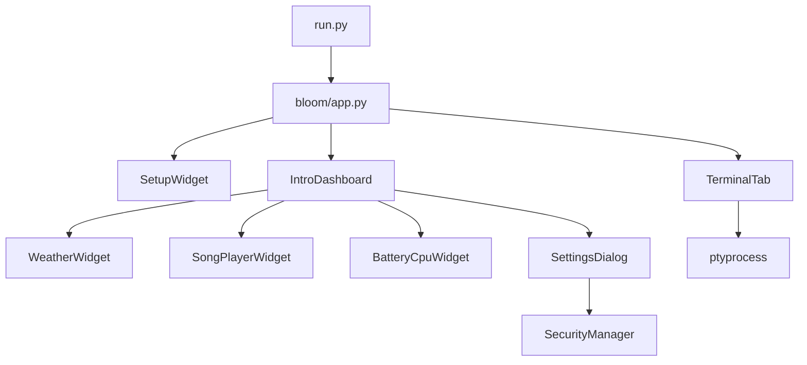

# Architecture Diagram

```mermaid
graph TD
    A[run.py] --> B[bloom/app.py]
    B --> C[SetupWidget]
    B --> D[IntroDashboard]
    B --> E[TerminalTab]
    D --> F[WeatherWidget]
    D --> G[SongPlayerWidget]
    D --> H[BatteryCpuWidget]
    D --> I[SettingsDialog]
    E --> J[ptyprocess]
    I --> K[SecurityManager]
```
