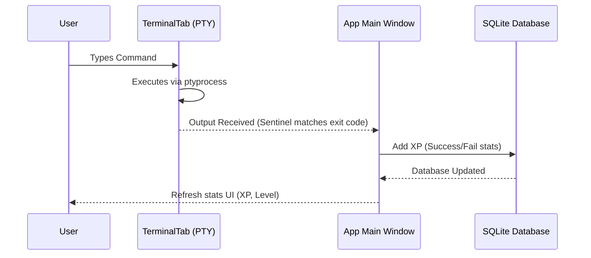

# Data Flow Diagram

```mermaid
sequenceDiagram
    participant User
    participant Shell as TerminalTab (PTY)
    participant UI as App Main Window
    participant DB as SQLite Database

    User->>Shell: Types Command
    Shell->>Shell: Executes via ptyprocess
    Shell-->>UI: Output Received (Sentinel matches exit code)
    UI->>DB: Add XP (Success/Fail stats)
    DB-->>UI: Database Updated
    UI-->>User: Refresh stats UI (XP, Level)
```
