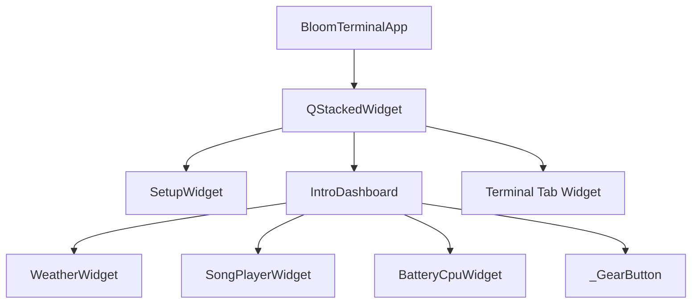

# Widget Hierarchy Diagram

```mermaid
graph TD
    App[BloomTerminalApp] --> Stack[QStackedWidget]
    Stack --> Setup[SetupWidget]
    Stack --> Intro[IntroDashboard]
    Stack --> Terminal[Terminal Tab Widget]
    
    Intro --> Weather[WeatherWidget]
    Intro --> Player[SongPlayerWidget]
    Intro --> Stats[BatteryCpuWidget]
    Intro --> Gear[_GearButton]
```
